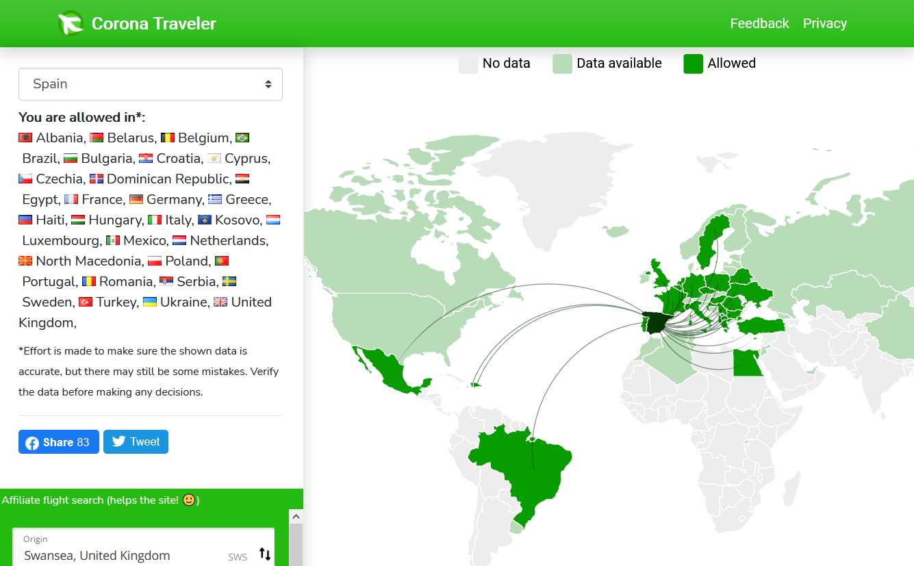

# Corona Traveler
Complete source code for my website [coronatraveler.com](https://coronatraveler.com/), written with a **Django** backend and a **React** frontend.

Frontend React code is located in [<code>/tourist/src/components/</code>](https://github.com/FillipdotS/corona-traveler/tree/master/tourist/src/components). I used <code>amcharts</code> to create the world map. The important Django code is mostly in the /tourist/ folder.

